# NodeSecure-Report
 

# Capítulo I: Introducción

## 1.1. Startup Profile

### 1.1.1. Descripción de la Startup

En el entorno logístico y empresarial actual, el control de inventarios y la seguridad de los almacenes enfrentan grandes desafíos, especialmente debido a las pérdidas por el "robo hormiga", accesos no autorizados y a un monitoreo deficiente en tiempo real. Los sistemas de seguridad tradicionales suelen ser puramente reactivos, limitándose a grabar incidentes sin ofrecer herramientas analíticas para prevenirlos de forma inmediata. Frente a este escenario, SafeZone emerge como una startup tecnológica enfocada en transformar la gestión de la seguridad industrial y comercial. Nuestra misión es ofrecer un ecosistema inteligente que permita a los negocios dejar atrás la vigilancia pasiva, otorgándoles un control activo y preventivo sobre sus activos más valiosos.

Para dar solución a esta problemática, SafeZone ha desarrollado NodeSecure, una plataforma inteligente de control de inventario potenciada por la trazabilidad de la tecnología IoT. NodeSecure va mucho más allá de ser un simple registro digital de productos o un hardware que controla puertas físicas; es un sistema web integral que relaciona directamente los movimientos operativos del inventario con los eventos físicos que suceden dentro de las instalaciones. La idea central que hace único a nuestro producto es que el software registra detalladamente lo que digitalmente debería ocurrir, mientras que los dispositivos IoT actúan como evidencia física para informar lo que realmente sucedió en el espacio.

El ecosistema de NodeSecure funciona utilizando dispositivos físicos simples, como sensores magnéticos, que reportan constantemente la actividad del entorno. Cuando la plataforma detecta un evento físico, como la apertura de un almacén, lo compara de forma automática con el historial de entradas y salidas registradas. Si se produce una acción física que no cuenta con un movimiento de inventario asociado que la justifique, el sistema identifica la discrepancia y genera una alerta inmediata. Gracias a un dashboard unificado, los administradores pueden supervisar múltiples áreas, auditar quién realizó cada operación y mantener una trazabilidad temporal exacta, facilitando respuestas rápidas ante cualquier irregularidad o desconexión.

La propuesta de valor de SafeZone está diseñada bajo un modelo altamente escalable, adaptándose tanto a dueños de PYMES que buscan soluciones accesibles para evitar mermas diarias, como a jefes de operaciones que requieren controlar redes complejas y auditar incidentes de forma rigurosa. El verdadero diferencial comercial de NodeSecure radica en brindar una visibilidad operativa total: permite a los usuarios saber con precisión qué mercancía salió, quién fue el responsable de registrarla, en qué momento exacto ocurrió y, lo más importante, advertir al instante si hubo alguna actividad física anómala que no cuadre con el registro oficial.

### 1.1.2 Integrantes del equipo

<table>
  <tr>
    <td align="center">
      
    </td>
    <td>
      <strong>Nombres y Apellidos:</strong> Anahua Ancachi Liz Maribel 
      <strong>Código:</strong> U202421123 
      <strong>Carrera:</strong> Ingeniería de Software  
      Estudiante de Ingeniería de Software en la UPC de quinto ciclo de la carrera. Tengo conocimientos básicos en C++, SQL. Me considero una persona responsable y empática a la hora de colaborar en equipo. Además, me encanta el diseño y plantear soluciones creativas a los problemas para entregar el mejor resultado posible.
    </td>
  </tr>
  <tr>
    <td align="center">
      
    </td>
    <td>
      <strong>Nombres y Apellidos:</strong> Fernando Sebastián Pérez Bellido 
      <strong>Código:</strong> U202410420 
      <strong>Carrera:</strong> Ingeniería de Software  
      Estudiante de Ingeniería de Software en la UPC con un enfoque en la creación de soluciones tecnológicas que generen impacto real. Cuento con bases sólidas en C++, Python y un poco de conocimiento en React, complementadas con conocimientos en SQL y entornos cloud. Me apasiona aplicar la lógica algorítmica para resolver problemas complejos.
    </td>
  </tr>
  <tr>
    <td align="center">
      
    </td>
    <td>
      <strong>Nombres y Apellidos:</strong> Ravello Cárdenas Luciana Angielina 
      <strong>Código:</strong> U20221F887 
      <strong>Carrera:</strong> Ingeniería de Software  
      Estudiante de Ingeniería de Software en la UPC cursando el quinto ciclo de la carrera. Tengo conocimientos en C++, SQL y Figma. Se me considera una persona amable y responsable, lo que ayuda a crear un buen ambiente en equipo. Siempre estoy dispuesta a escuchar opiniones y sugerencias para mejorar la calidad de los trabajos entregados.
    </td>
  </tr>
  <tr>
    <td align="center">
      
    </td>
    <td>
      <strong>Nombres y Apellidos:</strong> Sandoval Aiquipa Kelber Yamir 
      <strong>Código:</strong> U202418645 
      <strong>Carrera:</strong> Ingeniería de Software  
      Estudiante de Ingeniería de Software en la UPC, cursando el quinto ciclo. Soy un apasionado por el diseño de experiencia de usuario (UX/UI) y la creación de interfaces limpias, accesibles e intuitivas. Gracias a mi experiencia liderando equipos y gestionando la atención directa con el público, he desarrollado una gran empatía para entender las necesidades de los usuarios y traducirlas en soluciones tecnológicas efectivas. Me gusta aportar creatividad, orden y una excelente comunicación para asegurar que el producto final no solo funcione bien, sino que se vea increíble.
    </td>
  </tr>
</table>

## 1.2. Solution Profile

### 1.2.1. Antecedentes y problemática

Hoy en día, la gestión logística y el sector retail enfrentan un desafío crítico que compromete directamente su rentabilidad: la pérdida sistemática de inventario. En Perú, estudios revelan que las mermas en el sector comercial peruano generan pérdidas de entre S/ 700 y S/ 1,000 millones anuales. Lo más preocupante es que cerca del 52% de estas pérdidas corresponde a la llamada "merma desconocida", una categoría conformada en su gran mayoría por hurtos, fraudes y el persistente "robo hormiga". Este último fenómeno, caracterizado por la sustracción de pequeñas cantidades de mercadería a lo largo del tiempo, resulta sumamente complejo de detectar mediante auditorías convencionales, acumulando daños financieros severos para las empresas (Conexión ESAN, 2026).

**<ins>5W + 2H de la problemática</ins>**

- **What? (¿Cuál es el problema?):** Pérdidas económicas significativas en los sectores de logística y retail debido a la "merma desconocida", específicamente por robos hormiga, hurtos y fraudes.

- **Who? (¿Quién lo sufre?):** Dueños de PYMES, gerentes de operaciones y jefes de seguridad en el sector retail, distribución y logística. 

- **Where? (¿Dónde ocurre?):** En almacenes, depósitos, bodegas y centros de distribución de empresas comerciales en Perú y en toda Latinoamérica.

- **When? (¿Cuándo ocurre?):** Durante la gestión diaria de inventarios, especialmente cuando los procesos de vigilancia son pasivos o reactivos y no permiten una detección inmediata de irregularidades.

- **Why? (¿Por qué ocurre?):** Por la desconexión operativa entre los registros digitales y la realidad física del almacén, sumado a que las empresas perciben la tecnología IoT preventiva comos costosa o compleja de implementar.

- **How? (¿Cómo se manifiesta?):** Mediante descuadres de inventario recurrentes, accesos físicos no detectados a tiempo (robo hormiga), revisiones manuales tardías y una pérdida total de trazabilidad operativa por la ausencia de sensores IoT que validen los registros digitales en tiempo real. 

- **How much? (¿Cuánto afecta?):**  Provoca continuas mermas económicas por falta de control físico, pérdida de inventario por "robos hormiga" y un elevado costo de oportunidad debido a la excesiva carga de tareas manuales al tener que auditar cámaras e incidentes de forma tardía.

### 1.2.2. Lean UX Process

#### 1.2.2.1. Lean UX Problem Statement

**El estado actual de** la gestión de inventario y seguridad operativa en almacenes **se ha enfocado principalmente en** el uso de sistemas de vigilancia estrictamente reactivos (como cámaras CCTV o candados) y en registros digitales aislados, obligando a las empresas a realizar auditorías manuales lentas y a depender de sistemas desconectados para investigar las mermas.

**Lo que los productos y servicios existentes no logran abordar es** la profunda desconexión entre los movimientos teóricos del sistema y los eventos físicos que realmente ocurren, sumado a la fuerte barrera económica que hace que las empresas rechacen tecnologías avanzadas al percibirlas como excesivamente costosas y complejas de implementar.

**Nuestro producto** (NodeSecure) **abordará esta brecha mediante** una plataforma web centralizada de control de inventario inteligente que permite monitorear los espacios, controlar accesos y gestionar la información en tiempo real, ya que utiliza tecnología IoT como fuente de evidencia física. El sistema valida y contrasta de forma automática las actividades registradas con cada apertura física realizada, identificando inconsistencias inmediatamente, optimizando la trazabilidad del inventario y enviando alertas en tiempo real.

**Nuestro enfoque inicial será** los dueños y administradores de PYMES, así como también los jefes de seguridad y operaciones del sector logístico.

**Sabremos que tenemos éxito cuando veamos** una alta tasa de retención en nuestros planes de suscripción, una adopción rápida de la plataforma sin necesidad de capacitaciones complejas, y una reducción comprobable en los tiempos de respuesta ante intrusiones y en las pérdidas originadas por robos internos en los almacenes de los clientes.

#### 1.2.2.2. Lean UX Assumptions

**Business Assumptions (Supuestos de Negocio)**
- Creemos que ofrecer un modelo SaaS por suscripción mensual escalable en tres niveles  (Básico, Premium y Corporativo) será financieramente viable y atractivo para distintos tamaños de empresa, permitiendo que las PYMES adopten nuestra solución sin barreras de entrada.
- Asumimos que NodeSecure logrará posicionarse y diferenciarse de la competencia no como un sistema de alarmas tradicional, sino como una plataforma inteligente que cruza en tiempo real los eventos físicos del almacén con los registros digitales de inventario. 
- Creemos que delegar la detección física a dispositivos de hardware y accesibles (como ESP32 y sensores magnéticos de puerta) nos permitirá enfocar todos nuestros recursos en perfeccionar el desarrollo de la plataforma de software, sin tener que asumir altos costos de mantenimiento de hardware.
- Asumimos que lograremos captar la retención de nuestro mercado objetivo de manera satisfactoria destacando la accesibilidad económica de la solución y su facilidad de despliegue, frente a los sistemas tradicionales que las empresas perciben como altamente costosos o complejos.

**Business Outcome Assumptions (Supuestos de Resultados de Negocio)**
- Creemos que el éxito de SafeZone se reflejará en un incremento sostenido de empresas suscritas a la plataforma NodeSecure a través de sus distintos planes.
- Asumimos que garantizaremos una alta tasa de retención, particularmente de clientes corporativos, siempre que la plataforma web sea estable, confiable y precisa en la emisión de notificaciones en tiempo real.
- Creemos que las empresas que implementen nuestro producto lograrán reducir de forma significativa sus mermas económicas y pérdidas provocadas por el "robo hormiga" y los accesos no autorizados.
- Asumimos que el uso de nuestro sistema impulsará un cambio en la forma en que las empresas y comercios gestionan su seguridad, logrando que las empresas migren de un modelo de vigilancia reactiva a una gestión de seguridad preventiva.

**User Assumptions (Supuestos del Usuario)**
- Creemos que nuestros usuarios para los planes básicos son dueños o administradores de PYMES que gestionan pequeños almacenes y que actualmente dependen de controles manuales o en hojas de cálculo.
- Asumimos que nuestros usuarios para los planes superiores son jefes de seguridad o de operaciones a cargo de supervisar redes complejas de múltiples zonas logísticas.
- Creemos que ambos perfiles de usuario valoran profundamente las interfaces limpias, directas y accesibles desde cualquier lugar, buscando evitar el uso de configuraciones tecnológicas complejas.
- Consideramos que el principal problema de estos públicos radica en la molestia que genera rastrear mermas a través de plataformas fragmentadas, dificultando determinar con claridad qué pasó y en qué instante exacto.

**User Outcome and Benefit Assumptions (Supuestos de Resultados y Beneficios para el Usuario)**
- Creemos que los dueños de PYMES podrán tener mayor tranquilidad operativa al mantener el control de sus negocios y supervisar las aperturas de forma remota, sin necesidad de estar físicamente en el local.
- Asumimos que los jefes de operaciones podrán actuar rápidamente ante cualquier irregularidad gracias a las alertas automáticas que recibirán a través de un panel centralizado.
- Creemos que el personal de auditoría podrá reducir considerablemente las tareas manuales al utilizar las marcas de tiempo exactas de los eventos registrados para ubicar rápidamente las grabaciones de CCTV, evitando revisar horas de video sin una referencia clara .
- Asumimos que las empresas con múltiples sucursales lograrán estandarizar y centralizar la toma de decisiones al visualizar el estado de toda su infraestructura logística desde un único punto de acceso.

**Feature Assumptions (Supuestos de Funcionalidades)**
- Creemos que nuestra propuesta de valor residirá en un Dashboard Unificado que consolide el inventario disponible, el historial de movimientos, las alertas críticas y el estado de conexión de los sensores IoT en un solo lugar.
- Asumimos que el motor de detección de discrepancias, el cual comparará los eventos físicos del IoT con los movimientos de inventario registrados, será la herramienta funcional clave para descubrir sustracciones no reportadas.
- Creemos que establecer roles y permisos para cada tipo de usuario (Administrador, Almacenero, Auditor) permitirá proteger el acceso y la manipulación al stock controlando qué acciones puede realizar cada usuario según sus funciones.
- Asumimos que el desarrollo de una API RESTful estructurada para recibir los eventos (POST) emitidos por los microcontroladores permitirá procesar los registros de forma asíncrona, garantizando que el sistema sea capaz de registrar eventos críticos en tiempo real.

 

#### 1.2.2.3. Lean UX Hypothesis Statement

**Hypothesis Statement 1:** 
Creemos que lograremos incrementar la cantidad de empresas suscritas y mejorar la retención de nuestros clientes

Si los dueños de PYMES y jefes de seguridad

Obtienen el beneficio de centralizar la supervisión de todas sus sedes y mantener un control claro sin necesidad de estar físicamente presentes

Con un Dashboard Unificado que consolide el inventario disponible, el historial de movimientos, las alertas críticas y el estado de conexión de los sensores IoT en una sola pantalla.

**Hypothesis Statement 2:** 
Creemos que lograremos reducir drásticamente las pérdidas económicas causadas por robos internos y accesos no autorizados en los almacenes

Si los jefes de operaciones y dueños de negocios

Obtienen la capacidad de descubrir sustracciones no reportadas y reaccionar rápidamente ante cualquier incidente

Con un motor de detección de discrepancias que compare de forma automática los eventos físicos reportados por el IoT con los movimientos de inventario registrados en el sistema.

**Hypothesis Statement 3:** 
Creemos que lograremos brindar un servicio estable y confiable que asegure la retención de clientes del sector corporativo

Si los administradores, almaceneros y auditores

Logran interactuar con la plataforma de forma segura, garantizando que la manipulación del stock y la información estén protegidas de acuerdo a su jerarquía

Con la implementación de un modelo estricto de roles y permisos que delimite exactamente qué funciones y zonas puede consultar cada usuario.

**Hypothesis Statement 4:** 
Creemos que lograremos que las empresas modernicen su seguridad y pasen de un enfoque reactivo a uno puramente preventivo

Si el personal de seguridad y auditoría
Obtiene notificaciones críticas exactas y una marca de tiempo confiable para buscar evidencias precisas en sus cámaras CCTV

Con el desarrollo de una API RESTful estructurada (mediante peticiones POST) que reciba, asocie y procese en tiempo real los eventos físicos emitidos por los microcontroladores (ESP32).

 

#### 1.2.2.4. Lean UX Canvas

<table>
  <tbody>
    <tr>
      <td valign="top">
        <b>1. Business</b>  
        Las mermas desconocidas y el "robo hormiga" generan pérdidas millonarias en el sector comercial peruano. Existe una desconexión operativa entre el registro digital en software y los eventos físicos reales en almacenes. Las PYMES perciben la tecnología IoT como compleja y costosa.
      </td>
      <td valign="top">
        <b>5. Solutions</b> 
        <ul>
          <li>Plataforma Web SPA (Vue.js + ASP.NET Core) para gestión de inventario, movimientos y stock.</li>
          <li>Integración IoT pasiva (ESP32 con sensores magnéticos en puertas) para registrar aperturas físicas.</li>
          <li>Motor de detección automática de discrepancias entre aperturas físicas y registros.</li>
          <li>Registro histórico con timestamps para servir de índice en auditorías con CCTV.</li>
        </ul>
      </td>
      <td valign="top">
        <b>2. Business Outcomes</b> 
        <ul>
          <li>Reducción del 30% en tiempo dedicado a investigar pérdidas en cámaras CCTV.</li>
          <li>Disminución de un 25% en incidencias por descuadres de stock no justificados.</li>
          <li>Adopción del modelo SaaS en PYMES mediante el plan Básico.</li>
        </ul>
      </td>
    </tr>
    <tr>
      <td valign="top">
        <b>3. Users</b> 
        <ul>
          <li><b>Segmento 1:</b> Dueños de PYMES, Gerentes de Operaciones y Jefes de Seguridad.</li>
          <li><b>Segmento 2:</b> Encargados de Logística, Almaceneros y Personal Operativo.</li>
        </ul>
      </td>
      <td valign="top">
        <b>4. User Benefits</b> 
        <ul>
          <li>Visibilidad operativa total en tiempo real de lo que ocurre en sus almacenes.</li>
          <li>Respaldo laboral para el personal operativo al registrar quién y cuándo se realizó cada movimiento.</li>
          <li>Solución escalable y de bajo costo sin inversiones pesadas en hardware.</li>
        </ul>
      </td>
      <td valign="top"></td>
    </tr>
    <tr>
      <td valign="top">
        <b>6. Hypothesis</b>  
        Creemos que al cruzar eventos físicos (IoT) con movimientos digitales de inventario en tiempo real, lograremos reducir las mermas desconocidas en almacenes de PYMES, sabremos que tuvimos éxito cuando las alertas de discrepancia reduzcan el tiempo de auditoría en un 30%.
      </td>
      <td valign="top">
        <b>7. What’s the most important thing we need to learn first?</b>  
        Validar si los dueños de almacenes valoran tener una marca de tiempo exacta (timestamp) para cruzar con sus cámaras CCTV en lugar de requerir una integración directa de video en el software.
      </td>
      <td valign="top">
        <b>8. What’s the least amount of work we need to do to learn the next most important thing?</b>  
        Desarrollar un MVP funcional compuesto por un backend en ASP.NET Core, una SPA en Vue.js y un dispositivo ESP32 con sensor magnético de puerta para simular el flujo completo de detección de discrepancias.
      </td>
    </tr>
  </tbody>
</table>

 

## 1.3. Segmentos objetivo.
El modelo de negocio de SafeZone opera en el ámbito B2B (Business-to-Business) y busca reducir riesgos mientras digitaliza el control diario en almacenes e inventarios. Mediante nuestra plataforma NodeSecure, hemos identificado dos perfiles principales de clientes, cuyas necesidades cambian según el tamaño de su infraestructura y el nivel de control que requieren:

**Segmento 1: Dueños y Administradores de PYMES (Retail, Tiendas y Pequeños Almacenes)** 
Este segmento representa a los emprendedores, gerentes y dueños de pequeñas y medianas empresas. Constituyen el cliente ideal para los planes de entrada de la plataforma, ya que no suelen contar con el capital para mantener equipos de vigilancia física las 24 horas, pero tienen la necesidad crítica de proteger su inventario.

Aspectos demográficos:
- Edad: Entre 25 y 55 años.
- Ocupación: Dueños de negocio, gerentes generales o administradores comerciales.
- Nivel de digitalización: Medio-Alto en herramientas de uso cotidiano. Gestionan gran parte de la operación de su negocio desde dispositivos móviles y buscan interfaces intuitivas (dashboards limpios) que no requieran una curva de aprendizaje técnica.

 

Aspectos psicográficos y de comportamiento:
- Motivaciones: Obtener tranquilidad operativa y mantener el control de su patrimonio a distancia, evitando gastos asfixiantes en infraestructuras de seguridad tradicionales.
- Comportamiento y Dolores (Pain points): Viven con la preocupación constante de la merma por "robo hormiga". Su mayor frustración es depender de revisiones manuales y enterarse de los incidentes mucho tiempo después de que ocurrieron.
- Necesidades: Buscan herramientas digitales intuitivas y rápidas de poner en marcha, priorizando soluciones que envíen alertas inmediatas al móvil para reaccionar al instante ante cualquier anomalía o acceso no autorizado.

**Dato estadístico:** Las micro y pequeñas empresas representan el 99.2% del tejido empresarial peruano, siendo vitales para la economía nacional (Gobierno del Perú, 2024). Sin embargo, el 73% (de MYPES y de PYMES) carece de sistemas automatizados, lo que dificulta su transformación digital (Redacción EC, 2025). Esta carencia, agravada por una gestión de inventarios deficiente y el "robo hormiga", provoca pérdidas de hasta el 10% en sus ingresos, poniendo en riesgo su estabilidad financiera y subrayando la necesidad urgente de soluciones tecnológicas para un control eficaz (Loarte y Temple, 2024).

 

**Segmento 2: Jefes de Seguridad y Operaciones (Medianas y Grandes Corporaciones)** 
Este segmento agrupa a profesionales responsables de la integridad, seguridad industrial y eficiencia logística en grandes empresas (como centros de distribución, cadenas de retail y fábricas). Son el público objetivo de los planes corporativos,  pues operan bajo estrictas normativas y necesitan escalar el control a múltiples ubicaciones.
 
Aspectos demográficos:
- Edad: Entre 35 y 60 años.
- Ocupación: Jefes de Seguridad Industrial, Supervisores Logísticos, Supply Chain Managers o Jefes de Planta.
- Nivel de digitalización: Avanzado. Están habituados a la lectura de métricas de rendimiento, uso de sistemas de planificación (ERP) y software de gestión de almacenes (WMS).

 

Aspectos psicográficos y de comportamiento:
- Motivaciones: Buscan escalabilidad, reducción sistemática de riesgos operativos y lograr una visibilidad ininterrumpida de todas las sucursales a su cargo simultáneamente.
- Comportamiento y Dolores (Pain points): Sufren por la alta carga manual que implica cruzar información fragmentada (por ejemplo, buscar horas en grabaciones de cámaras para justificar una pérdida en el registro de Excel).
- Necesidades: Exigen trazabilidad absoluta (quién, qué, cuándo y dónde). Requieren configurar roles de usuario, permisos granulares por zonas de riesgo y contar con un sistema automatizado que funcione como un índice exacto para auditorías. 

**Dato estadístico:** La modernización logística es clave para la rentabilidad corporativa. Mientras un 30% de empresas aún opera con procesos convencionales y riesgos elevados (Aguilar y Chingay, 2025), la automatización mediante sensores IoT ha demostrado elevar la exactitud del inventario del 33% al 94% y la eficiencia operativa hasta en un 90% (Cespedes y Ponce, 2025). Esta integración minimiza pérdidas y optimiza la seguridad, reduciendo drásticamente los errores de supervisión.    

# Capítulo II: Requirements Elicitation & Analysis 
## 2.1. Competidores
### 2.1.1. Análisis competitivo
Para evaluar la posición estratégica de NodeSecure en el mercado de gestión de inventarios y trazabilidad con evidencia IoT, se seleccionaron tres competidores directos e indirectos clave:
Verkada: Plataforma empresarial de seguridad física basada en la nube que integra videovigilancia, sensores ambientales y control de accesos.
Quaker Software: Firma de desarrollo tecnológico especializada en la arquitectura e implementación personalizada de sistemas ERP, CRM y control de inventarios a medida para grandes industrias.
Samsara: Plataforma SaaS de operaciones conectadas con sensores IoT para el seguimiento de activos, logística y gestión operativa en almacenes.

<table>
  <thead>
    <tr>
      <th colspan="5" align="center"><h3>Competitive Analysis Landscape</h3></th>
    </tr>
  </thead>
  <tbody>
    <tr>
      <td width="20%"><b>¿Por qué llevar a cabo este análisis?</b></td>
      <td colspan="4">Identificar fortalezas, debilidades, oportunidades y amenazas de nuestra startup frente a soluciones existentes, para definir la propuesta de valor y las estrategias competitivas que nos permitan diferenciarnos.</td>
    </tr>
    <tr>
      <td><b>En la cabecera colocar por cada competidor nombre y logo</b></td>
      <td align="center" width="20%">
        <b>Su Startup:</b> <b>NodeSecure</b>  
        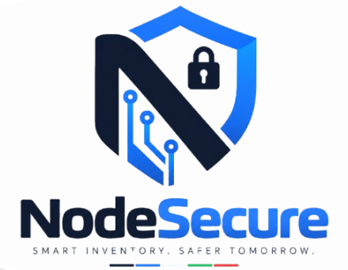
      </td>
      <td align="center" width="20%">
        <b>Competidor 1:</b> <b>Verkada</b>  
        
      </td>
      <td align="center" width="20%">
        <b>Competidor 2:</b> <b>Quaker Software</b>  
        
      </td>
      <td align="center" width="20%">
        <b>Competidor 3:</b> <b>Samsara</b>  
        
      </td>
    </tr>
    <!-- PERFIL OVERVIEW -->
    <tr>
      <td rowspan="2"><b>Perfil</b></td>
      <td colspan="4"><b>Overview</b></td>
    </tr>
    <tr>
      <td>Plataforma web de gestión de inventario que registra los movimientos digitales de productos y utiliza IoT como evidencia física para detectar discrepancias y facilitar auditorías.</td>
      <td>Sistema de seguridad física basado en hardware propietario conectado a la nube para videovigilancia y control de accesos corporativos.</td>
      <td>Firma de desarrollo a medida que implementa soluciones ERP, CRM y módulos de control de inventario según requerimientos del cliente.</td>
      <td>Plataforma SaaS de operaciones conectadas que utiliza sensores IoT en almacenes y flotas para visibilidad en tiempo real.</td>
    </tr>
    <!-- VENTAJA COMPETITIVA -->
    <tr>
      <td colspan="1"><b>Ventaja competitiva ¿Qué valor ofrece a los clientes?</b></td>
      <td>Correlación entre los movimientos de inventario digitales y eventos físicos (sensores) para servir como un índice de trazabilidad que facilita las auditorías sin requerir cámaras costosas integradas.</td>
      <td>Ecosistema de hardware moderno con analítica avanzada de video e Inteligencia Artificial centralizada en la nube.</td>
      <td>Alta capacidad de personalización e integración profunda con flujos de trabajo empresariales a gran escala.</td>
      <td>Plataforma IoT industrial consolidada con trazabilidad logística de activos y analítica avanzada.</td>
    </tr>
    <!-- PERFIL DE MARKETING -->
    <tr>
      <td rowspan="2"><b>Perfil de Marketing</b></td>
      <td colspan="4"><b>Mercado objetivo</b></td>
    </tr>
    <tr>
      <td>Dueños de PYMES, administradores y jefes de operaciones/seguridad en almacenes, depósitos y centros de distribución.</td>
      <td>Grandes corporaciones, sector educativo e industrias de gran escala con presupuesto elevado.</td>
      <td>Empresas de manufactura, firmas financieras y grandes corporaciones con procesos de software personalizados.</td>
      <td>Empresas medianas y grandes de logística, transporte, distribución y almacenamiento.</td>
    </tr>
    <tr>
      <td><b>Estrategias de marketing</b></td>
      <td>Marketing B2B digital, demostraciones operativas del flujo web/IoT y alianzas con consultoras logísticas y de retail.</td>
      <td>Venta directa mediante canal corporativo (Enterprise Sales), presencia en ferias globales y marketing técnico.</td>
      <td>Venta consultiva B2B, desarrollo de proyectos por contrato y redes de partners tecnológicos.</td>
      <td>Venta directa B2B, pruebas piloto gratuitas para almacenes/flotas y presencia en ferias del sector.</td>
    </tr>
    <!-- PERFIL DE PRODUCTO -->
    <tr>
      <td rowspan="2"><b>Perfil de Producto</b></td>
      <td colspan="4"><b>Productos & Servicios</b></td>
    </tr>
    <tr>
      <td>Aplicación Web (Vue.js + ASP.NET Core), registro de entradas/salidas, alertas de discrepancia, índice de auditoría temporal y conexión IoT (ESP32).</td>
      <td>Cámaras IP, controladores de acceso, sensores ambientales, intercomunicadores y consola Command.</td>
      <td>Desarrollo de ERP/CRM a medida, módulos de inventario, auditoría de operaciones y servicios de consultoría IT.</td>
      <td>Sensores IoT de entorno y puertas, rastreadores de activos, cámaras con IA y software de gestión operativa.</td>
    </tr>
    <tr>
      <td><b>Precios & Costos</b></td>
      <td>Esquema SaaS con Plan Básico (solo software), Plan Premium (inventario + IoT) y Plan Corporativo adaptado a PYMES.</td>
      <td>Elevado costo inicial en hardware propietario e licencias de software anuales por dispositivo.</td>
      <td>Elevados costos iniciales de desarrollo a medida y licencias corporativas según el alcance del proyecto.</td>
      <td>Suscripción SaaS por activo/dispositivo orientada a presupuestos corporativos medianos y altos.</td>
    </tr>
    <tr>
      <td><b>Canales de distribución (Web y/o Móvil)</b></td>
      <td>Aplicación Web Responsive (SPA) y Landing Page corporativa.</td>
      <td>Plataforma Cloud propietaria, distribuidores autorizados e integradores de sistemas.</td>
      <td>Venta directa mediante consultoría tecnológica y despliegues web/cloud corporativos.</td>
      <td>Venta directa a través de su plataforma SaaS y red global de socios tecnológicos.</td>
    </tr>
    <!-- ANÁLISIS SWOT / FODA -->
    <tr>
      <td colspan="5" align="center"><b>Análisis SWOT / FODA</b> <i>Realice esto para su startup y sus competidores. Sus fortalezas deberían apoyar sus oportunidades y contribuir a lo que ustedes definen como su posible ventaja competitiva.</i></td>
    </tr>
    <tr>
      <td><b>Fortalezas</b></td>
      <td>Correlación en tiempo real entre eventos físicos del sensor magnético/IoT y el software de inventario.</td>
      <td>Menor costo de implementación comparado con infraestructuras pesadas de videovigilancia corporativa.</td>
      <td>Plataforma web nativa, ligera y de fácil adopción para personal operativo.</td>
      <td>Solución tecnológica consolidada en el mercado.</td>
    </tr>
    <tr>
      <td><b>Debilidades</b></td>
      <td>Marca en etapa inicial sin posicionamiento previo en el mercado local.</td>
      <td>Dependencia de la conectividad de red local para el reporte en tiempo real de los nodos IoT.</td>
      <td>Largo tiempo de desarrollo y costo elevado.</td>
      <td>Curva de aprendizaje inicial requerida para configuración.</td>
    </tr>
    <tr>
      <td><b>Oportunidades</b></td>
      <td>Elevada pérdida económica en Perú por "merma desconocida" (S/ 700 a S/ 1,000 millones anuales).</td>
      <td>Baja penetración de sistemas de auditoría automatizada en PYMES logísticas locales debido a los altos costos de la competencia.</td>
      <td>Adopción creciente de transformación digital en empresas medianas.</td>
      <td>Crecimiento del mercado de logística e IoT en la región.</td>
    </tr>
    <tr>
      <td><b>Amenazas</b></td>
      <td>Entrada de competidores de seguridad tradicional incorporando sensores de bajo costo.</td>
      <td>Resistencia al cambio tecnológico por parte del personal de almacén acostumbrado a procesos manuales.</td>
      <td>Llegada de soluciones estándar a menor precio.</td>
      <td>Competencia agresiva de precios por parte de proveedores globales consolidados.</td>
    </tr>
  </tbody>
</table>

#### 2.1.2. Estrategias y tácticas frente a competidores

Estrategia de diferenciación mediante trazabilidad físico-digital:
Posicionar a NodeSecure como una solución que integra la gestión de inventario con la evidencia generada por dispositivos IoT. A diferencia de las plataformas enfocadas únicamente en videovigilancia, control de accesos o gestión logística, NodeSecure busca relacionar los movimientos registrados digitalmente con los eventos físicos detectados en el almacén.
Táctica: comunicar esta propuesta mediante demostraciones del flujo completo, mostrando cómo una apertura física puede contrastarse con los movimientos registrados y generar una alerta cuando exista una discrepancia.
Estrategia de adopción progresiva para PYMES:
Reducir la barrera de entrada tecnológica y económica mediante un modelo SaaS escalable. El cliente puede comenzar utilizando las funcionalidades de gestión de inventario y posteriormente incorporar sensores IoT según sus necesidades y presupuesto.
Táctica: ofrecer planes diferenciados Básico, Premium y Corporativo que permitan incrementar progresivamente el nivel de monitoreo sin requerir una implementación completa desde el inicio. 

Estrategia de facilidad de uso para reducir la resistencia al cambio:
Considerando que una de las amenazas identificadas es la resistencia del personal de almacén acostumbrado a procesos manuales, NodeSecure debe priorizar una experiencia de uso sencilla y rápida.
Táctica: diseñar una interfaz web con procesos de registro de entradas y salidas que requieran pocos pasos, además de mantener la detección de eventos IoT funcionando en segundo plano para no interrumpir las actividades operativas. 
Estrategia de confianza basada en evidencia y trazabilidad:
Construir la propuesta de valor alrededor de la generación de evidencia verificable sobre las operaciones realizadas. La plataforma debe permitir identificar quién realizó una operación, qué movimiento efectuó y cuándo ocurrió, complementando esta información con los eventos físicos registrados por los sensores.
Táctica: utilizar dashboards, alertas, historial de eventos y marcas de tiempo para facilitar la supervisión y las posteriores auditorías. 

## 2.2.1. Diseño de entrevistas
Para comprender a fondo los dolores y validar las necesidades de nuestro público y  levantar los requerimientos del sistema SafeZone (NodeSecure), se diseñaron dos guiones de entrevistas semiestructuradas enfocados en nuestros dos segmentos de usuario objetivo.

Entrevista - Segmento 1: Dueños de PYMES y Jefes de Operaciones / Almacén 

¿Cuáles son los principales problemas o pérdidas que ha detectado en el control diario de su almacén o negocio?
¿Ha tenido problemas con robos, pérdidas o faltantes de mercadería? ¿Qué suele ocurrir cuando se presenta alguno de estos casos?
¿Cómo realizan actualmente el registro y control de las entradas, salidas y del stock disponible de mercadería?
¿Con qué mecanismos cuentan actualmente para supervisar quién entra o sale de las zonas de almacenamiento?
Por ejemplo, cámaras y registros
¿Con qué frecuencia encuentran diferencias entre el stock que tienen registrado y la mercadería que realmente tienen físicamente?
Cuando detectan un faltante, ¿qué tan difícil les resulta determinar qué ocurrió y quiénes estuvieron presentes en ese momento?
¿Qué tan útil sería para usted recibir una alerta en su celular cuando ocurra algo fuera de lo normal, como una apertura de puerta fuera de horario o una posible discrepancia de inventario?
Si pudiera consultar la fecha y hora exacta en que ocurrió un incidente, ¿consideraría útil esa información para revisar directamente ese momento en sus cámaras o registros? ¿Por qué?
Pensando en una herramienta que ayude a controlar el inventario y detectar este tipo de situaciones, ¿qué características considera más importantes para que realmente le resulte útil en su negocio?
¿Estaría dispuesto a utilizar una solución de este tipo en su negocio? ¿Qué factores tendría en cuenta para decidir adoptarla?

Entrevista - Segmento 2: Encargados de Logística y Personal Operativo 

¿Cómo es normalmente el proceso cuando realizas una entrada o salida de productos en el almacén?
¿Qué herramientas utilizas habitualmente para registrar los movimientos de productos?
 Por ejemplo: computadora, celular, tablet, Excel u otro sistema.
¿Cuánto tiempo aproximadamente te toma registrar una entrada o salida de productos?
¿Qué dificultades encuentras actualmente al registrar y controlar el inventario?
¿Qué ocurre cuando necesitas registrar una salida rápidamente y el sistema resulta lento o complicado de utilizar?
¿Con qué frecuencia se presentan descuadres entre el stock registrado y la cantidad de productos que realmente tienen?
Cuando ocurre un descuadre de stock, ¿qué tan fácil o difícil es identificar quién realizó el movimiento y cuándo ocurrió?
¿Qué características consideras indispensables en una aplicación para registrar los movimientos de productos de forma rápida y sencilla?
¿Qué tan útil sería para ti que la plataforma genere automáticamente un registro de la fecha y hora del evento?
¿Crees que contar con este tipo de registros te ayudaría a identificar mejor qué ocurrió cuando se presenta un descuadre de inventario?
¿Te gustaría controlar toda la información importante de manera remota?

<h3>Segmento 01: Dueños y Administradores de Almacén</h3>

<table>
  <tr>
    <td width="20%"><strong>Entrevistador</strong></td>
    <td>[Nombre del Entrevistador]</td>
  </tr>
  <tr>
    <td><strong>Entrevistado</strong></td>
    <td>Francisco Robles Mendoza</td>
  </tr>
  <tr>
    <td><strong>Edad</strong></td>
    <td>38 años</td>
  </tr>
  <tr>
    <td><strong>Distrito</strong></td>
    <td>Ate, Lima</td>
  </tr>
  <tr>
    <td><strong>Evidencia</strong></td>
    <td><a href="#" target="_blank">Ver Evidencia</a></td>
  </tr>
  <tr>
    <td><strong>Resumen</strong></td>
    <td>Administra un almacén de suministros eléctricos. Menciona que las mermas no explicadas al mes representan una pérdida de hasta el 8% al trimestre. Registra inventarios en Excel e inspeccionan con cámaras analógicas fijas. Expresa que revisar horas de video para hallar un faltante es ineficiente. Considera de enorme utilidad recibir alertas en el celular ante eventos anómalos y contar con la fecha y hora (<em>timestamp</em>) exacta para auditar las grabaciones directamente.</td>
  </tr>
</table>

 

<table>
  <tr>
    <td width="20%"><strong>Entrevistador</strong></td>
    <td>[Nombre del Entrevistador]</td>
  </tr>
  <tr>
    <td><strong>Entrevistado</strong></td>
    <td>Patricia Sofía Ramos Vílchez</td>
  </tr>
  <tr>
    <td><strong>Edad</strong></td>
    <td>[Edad]</td>
  </tr>
  <tr>
    <td><strong>Distrito</strong></td>
    <td>San Juan de Miraflores, Lima</td>
  </tr>
  <tr>
    <td><strong>Evidencia</strong></td>
    <td><a href="#" target="_blank">Ver Evidencia</a></td>
  </tr>
  <tr>
    <td><strong>Resumen</strong></td>
    <td>Dueña de una distribuidora de abarrotes al por mayor. Presenta problemas con el "robo hormiga" y desbalances de productos no anotados a tiempo. Actualmente utiliza un cuaderno físico y control visual. Destaca que recibir alertas remotas en el celular le daría un control absoluto para supervisar su negocio a distancia y cruzar la hora de apertura de puertas con las ventas realizadas.</td>
  </tr>
</table>

 

<table>
  <tr>
    <td width="20%"><strong>Entrevistador</strong></td>
    <td>[Nombre del Entrevistador]</td>
  </tr>
  <tr>
    <td><strong>Entrevistado</strong></td>
    <td>Roberto Alonzo Gutiérrez Farfán</td>
  </tr>
  <tr>
    <td><strong>Edad</strong></td>
    <td>[Edad]</td>
  </tr>
  <tr>
    <td><strong>Distrito</strong></td>
    <td>San Luis, Lima</td>
  </tr>
  <tr>
    <td><strong>Evidencia</strong></td>
    <td><a href="#" target="_blank">Ver Evidencia</a></td>
  </tr>
  <tr>
    <td><strong>Resumen</strong></td>
    <td>Jefe de Operaciones de 3 sedes ferreteras. Sufre por el desfase de información entre tiendas y el tiempo invertido en auditorías por faltantes de herramientas. Ve indispensable un Dashboard centralizado para monitorear las sedes de manera simultánea, junto con la gestión de permisos por roles de usuario e historial de registros inalterables para agilizar las investigaciones.</td>
  </tr>
</table>

 

<!-- ========================================== -->
<!-- REGISTRO DE ENTREVISTAS - SEGMENTO 02      -->
<!-- ========================================== -->
<h3>Segmento 02: Personal Operativo y Almaceneros</h3>

<table>
  <tr>
    <td width="20%"><strong>Entrevistador</strong></td>
    <td>[Nombre del Entrevistador]</td>
  </tr>
  <tr>
    <td><strong>Entrevistado</strong></td>
    <td>Jorge Luis Huamán Quispe</td>
  </tr>
  <tr>
    <td><strong>Edad</strong></td>
    <td>[Edad]</td>
  </tr>
  <tr>
    <td><strong>Distrito</strong></td>
    <td>Santiago de Surco, Lima</td>
  </tr>
  <tr>
    <td><strong>Evidencia</strong></td>
    <td><a href="#" target="_blank">Ver Evidencia</a></td>
  </tr>
  <tr>
    <td><strong>Resumen</strong></td>
    <td>Encargado de recepción e inventario. Registra movimientos combinando libretas de papel con una computadora fija, lo que le toma entre 15 y 20 minutos por lote. Solicita una aplicación móvil rápida que se pueda usar desde celular o tablet con botones grandes. Valora el registro automático de fecha y hora para respaldar formalmente la recepción de carga en su turno.</td>
  </tr>
</table>

 

<table>
  <tr>
    <td width="20%"><strong>Entrevistador</strong></td>
    <td>[Nombre del Entrevistador]</td>
  </tr>
  <tr>
    <td><strong>Entrevistado</strong></td>
    <td>Valeria Isabel Morales Castro</td>
  </tr>
  <tr>
    <td><strong>Edad</strong></td>
    <td>[Edad]</td>
  </tr>
  <tr>
    <td><strong>Distrito</strong></td>
    <td>Villa El Salvador, Lima</td>
  </tr>
  <tr>
    <td><strong>Evidencia</strong></td>
    <td><a href="#" target="_blank">Ver Evidencia</a></td>
  </tr>
  <tr>
    <td><strong>Resumen</strong></td>
    <td>Auxiliar de almacén. Llenan formatos impresos en papel que demoran horas en procesarse administrativamente, generando confusión sobre el stock real. Considera que un sistema web amigable asociado a registros personales automáticos protegerá a los trabajadores honestos, aclarando la hora exacta en que ocurrió cualquier inconsistencia.</td>
  </tr>
</table>

 

<table>
  <tr>
    <td width="20%"><strong>Entrevistador</strong></td>
    <td>[Nombre del Entrevistador]</td>
  </tr>
  <tr>
    <td><strong>Entrevistado</strong></td>
    <td>Carla Paredes Benítez</td>
  </tr>
  <tr>
    <td><strong>Edad</strong></td>
    <td>26 años</td>
  </tr>
  <tr>
    <td><strong>Distrito</strong></td>
    <td>Ate, Lima</td>
  </tr>
  <tr>
    <td><strong>Evidencia</strong></td>
    <td><a href="#" target="_blank">Ver Evidencia</a></td>
  </tr>
  <tr>
    <td><strong>Resumen</strong></td>
    <td>Encargada de operaciones de despacho. Experimenta cuellos de botella al usar una única computadora compartida con hojas de Excel. Requiere una aplicación ágil que le permita registrar salidas en menos de 30 segundos de forma remota. Resalta que los registros automáticos con marcas de tiempo (timestamps) garantizarían total transparencia en el historial de movimientos de inventario.</td>
  </tr>
</table>

 

### 2.2.3. Análisis de entrevistas
Segmento 01 (Administrativo / Toma de decisiones):
La principal molestia de la gerencia es la pérdida de tiempo al investigar faltantes. La integración del sensor IoT con la plataforma web soluciona este problema al generar marcas de tiempo (timestamps) exactas que dirigen la revisión del video CCTV al minuto preciso del evento. 

Segmento 02 (Operativo / Campo):  
El personal de campo rechaza los sistemas complejos que entorpecen el despacho. Valoran la automatización de la fecha y hora porque agiliza el flujo de trabajo y sirve como prueba objetiva para deslindar responsabilidades en descuadres de stock. 

Variables de análisis identificadas:

<h3>Análisis Comparativo entre Segmentos</h3>

<table>
  <thead>
    <tr>
      <th>Variable</th>
      <th>Segmento 1 (Dueños / Administradores)</th>
      <th>Segmento 2 (Operativo / Almaceneros)</th>
    </tr>
  </thead>
  <tbody>
    <tr>
      <td><strong>Problemas y pérdidas recurrentes</strong></td>
      <td>Mermas no explicadas (hasta un 8% trimestral) y "robo hormiga" de productos de alto valor. Dificultad para supervisar múltiples sedes sin desfase de información.</td>
      <td>Descuadres semanales de inventario por olvido de registro manual en horas pico. Archivos de Excel bloqueados por uso concurrente y hojas de papel que se pierden.</td>
    </tr>
    <tr>
      <td><strong>Herramientas e infraestructura actual</strong></td>
      <td>Uso de hojas de cálculo en Excel o cuadernos físicos en recepción. Cámaras CCTV analógicas/IP que graban continuamente sin sensores asociados.</td>
      <td>Libretas de apunte, vales impresos en papel y uso de una única computadora de escritorio compartida.</td>
    </tr>
    <tr>
      <td><strong>Monitoreo y control de accesos</strong></td>
      <td>Control visual directo del encargado o cerraduras tradicionales. Las cámaras no permiten identificar el momento exacto de un incidente sin revisar horas de video.</td>
      <td>Responsabilidad diluida entre todo el personal del turno al no haber un control individualizado de quién ingresa al almacén o modifica el stock.</td>
    </tr>
    <tr>
      <td><strong>Impacto de las alertas y trazabilidad (timestamps)</strong></td>
      <td>Consideran crucial recibir alertas en el celular ante cierres/aperturas fuera de horario. Usar el timestamp exacto permite auditar las cámaras directamente en minutos.</td>
      <td>Exigen que el sistema registre la fecha, hora y usuario automáticamente como respaldo laboral de transparencia ante la gerencia por faltantes injustificados.</td>
    </tr>
    <tr>
      <td><strong>Requerimientos de la plataforma web/IoT</strong></td>
      <td>Dashboard centralizado para ver el estado del inventario y seguridad en tiempo real. Gestión estricta de permisos por roles de usuario y bajo costo de implementación.</td>
      <td>Aplicación web móvil/responsive para tablets y celular con interfaz sencilla, botones grandes y registros que tomen menos de 30 segundos.</td>
    </tr>
  </tbody>
</table>

 

## 2.3. Needfinding
A partir del análisis se identificaron necesidades recurrentes en ambos segmentos. Estas necesidades permiten orientar los siguientes artefactos de diseño.

Necesidades identificadas
Registrar las entradas y salidas de productos de manera rápida.
Mantener actualizado el stock disponible.
Identificar quién realizó cada movimiento.
Registrar automáticamente la fecha y hora de las operaciones.
Detectar diferencias entre movimientos digitales y eventos físicos.
Recibir alertas ante situaciones anómalas.
Consultar un historial de eventos.
Reducir el tiempo necesario para investigar incidentes.
Facilitar la consulta remota de información.
Mantener una interfaz sencilla para el personal operativo.

### 2.3.1. User Personas
Segmento 01: 
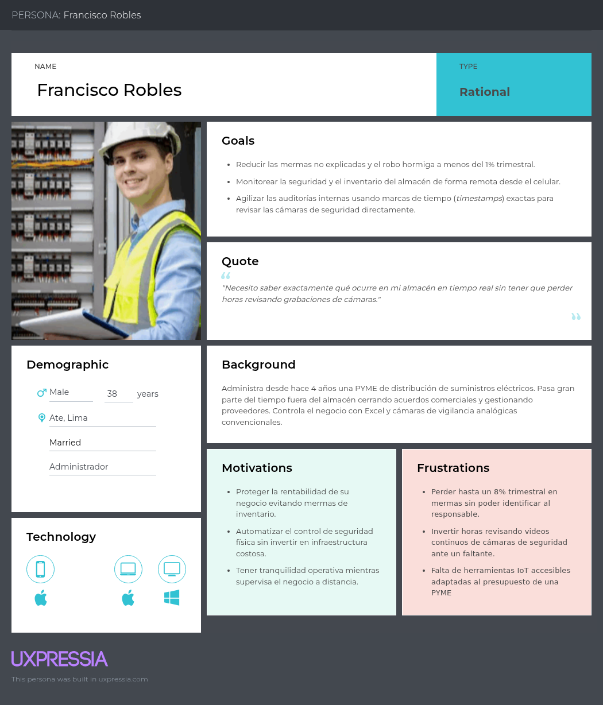

Segmento 02: 
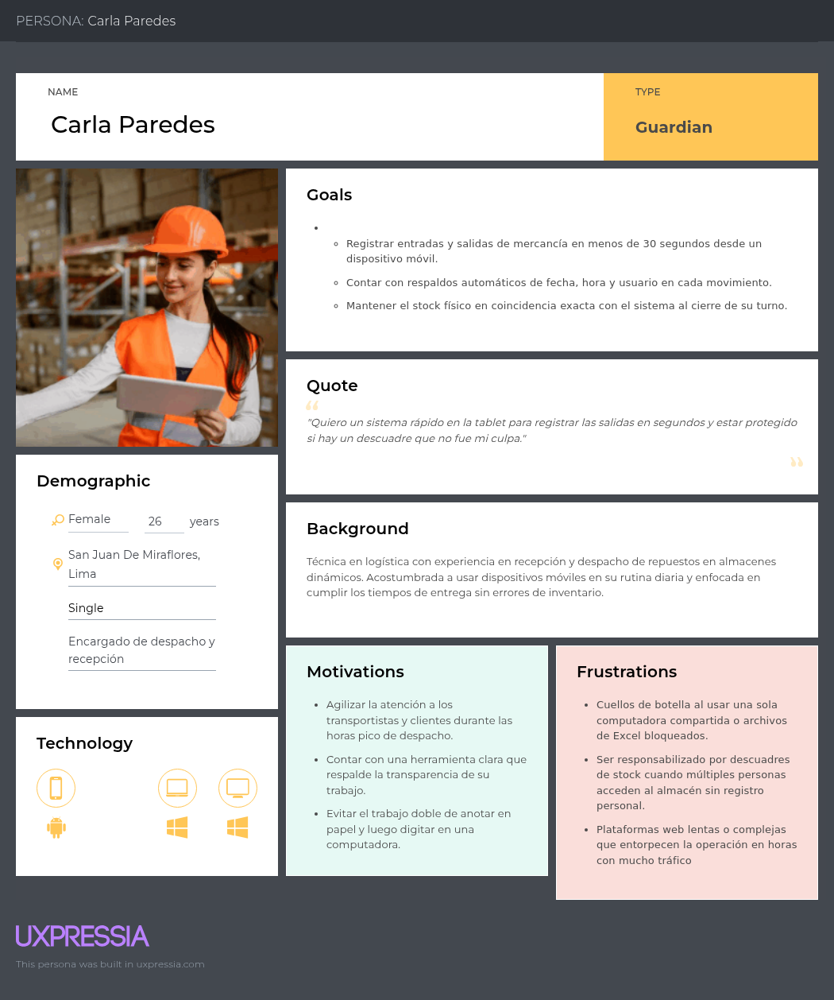

#### 2.3.2. User Task Matrix
<h3>Priorización de Tareas por Segmento</h3>

<table>
  <thead>
    <tr>
      <th>Tareas</th>
      <th>(Segmento 1) Francisco Robles</th>
      <th>(Segmento 2) Carla Paredes</th>
    </tr>
  </thead>
  <tbody>
    <tr>
      <td><strong>Inicio de Sesión y Autenticación</strong></td>
      <td>Media</td>
      <td>Alta</td>
    </tr>
    <tr>
      <td><strong>Gestión de Permisos y Roles</strong></td>
      <td>Alta</td>
      <td>Baja</td>
    </tr>
    <tr>
      <td><strong>Registro de Entradas y Salidas</strong></td>
      <td>Baja</td>
      <td>Alta</td>
    </tr>
    <tr>
      <td><strong>Generación Automática de Timestamps</strong></td>
      <td>Alta</td>
      <td>Alta</td>
    </tr>
    <tr>
      <td><strong>Monitoreo IoT y Sensores de Puertas</strong></td>
      <td>Alta</td>
      <td>Media</td>
    </tr>
    <tr>
      <td><strong>Alertas e Incidencias en Tiempo Real</strong></td>
      <td>Alta</td>
      <td>Baja</td>
    </tr>
    <tr>
      <td><strong>Dashboard Centralizado y Reportes</strong></td>
      <td>Alta</td>
      <td>Baja</td>
    </tr>
    <tr>
      <td><strong>Consulta Rápida de Inventario</strong></td>
      <td>Baja</td>
      <td>Baja</td>
    </tr>
  </tbody>
</table>

##### 2.3.3. User Journey Mapping

Segmento 01: 
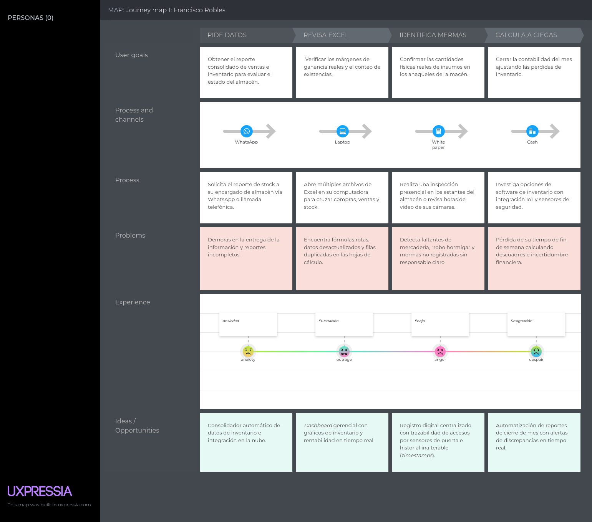

Segmento 02:
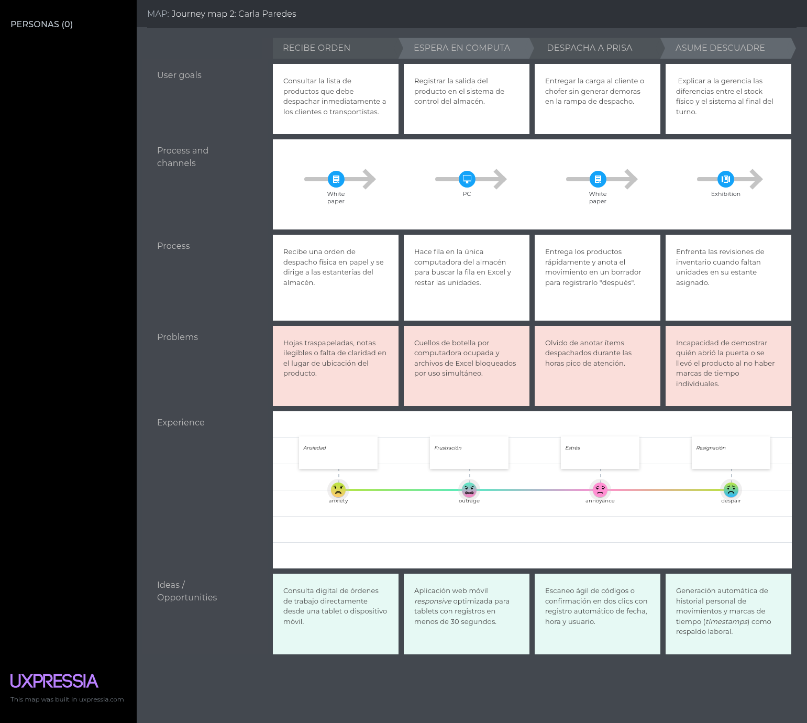

###### 2.3.4. Empathy Mapping

Segmento 01:
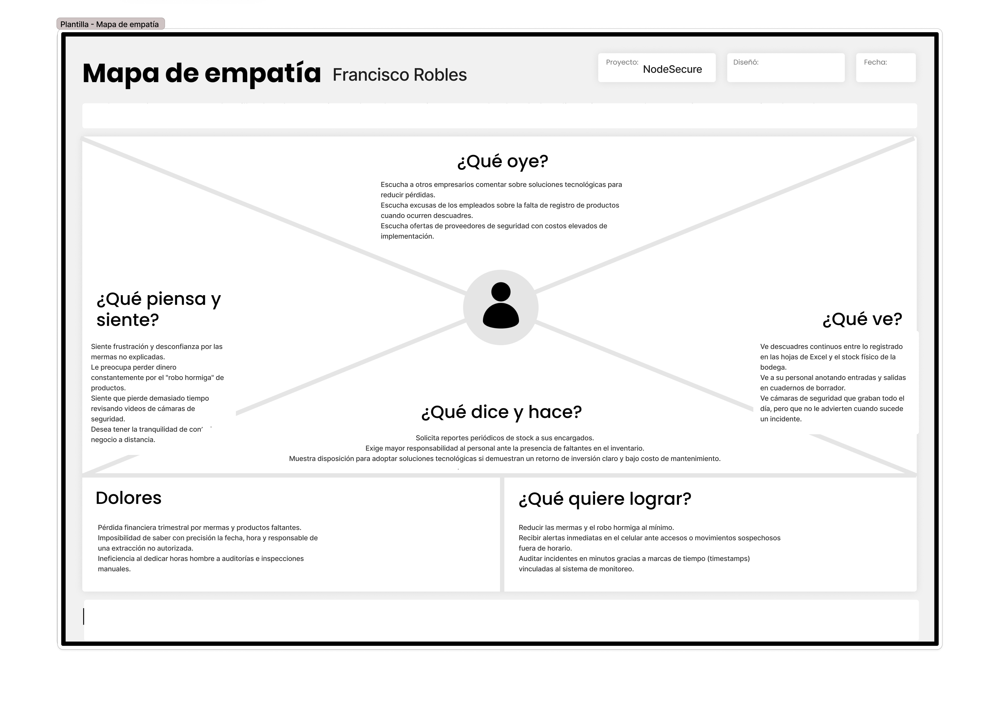

Segmento 02: 
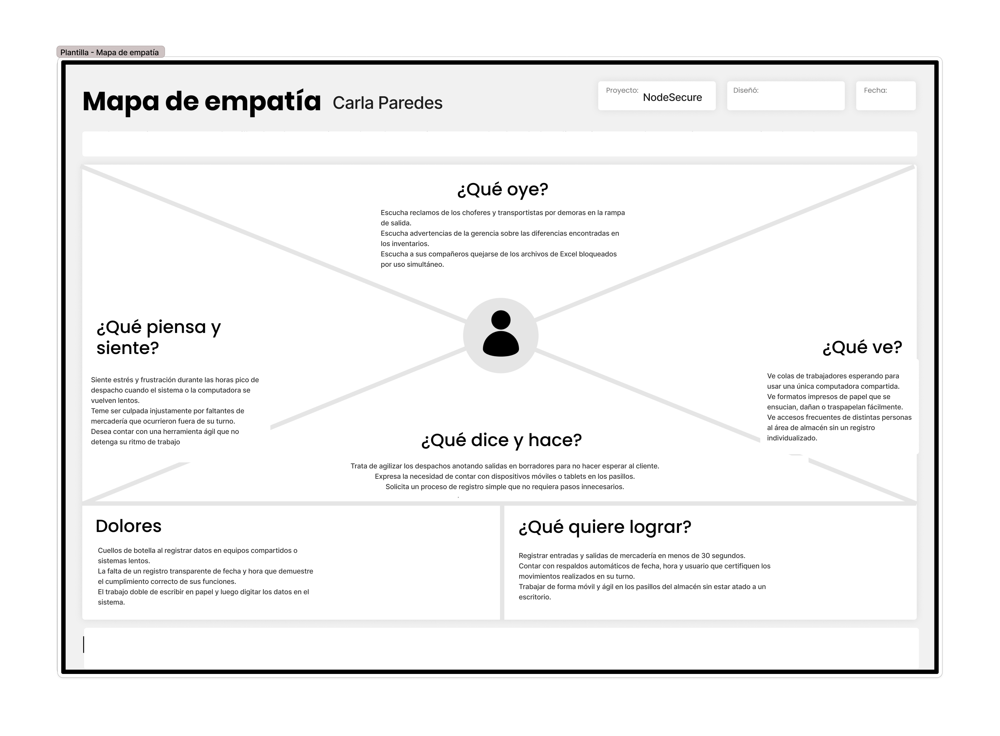

## 2.4. Big Picture Event Storming

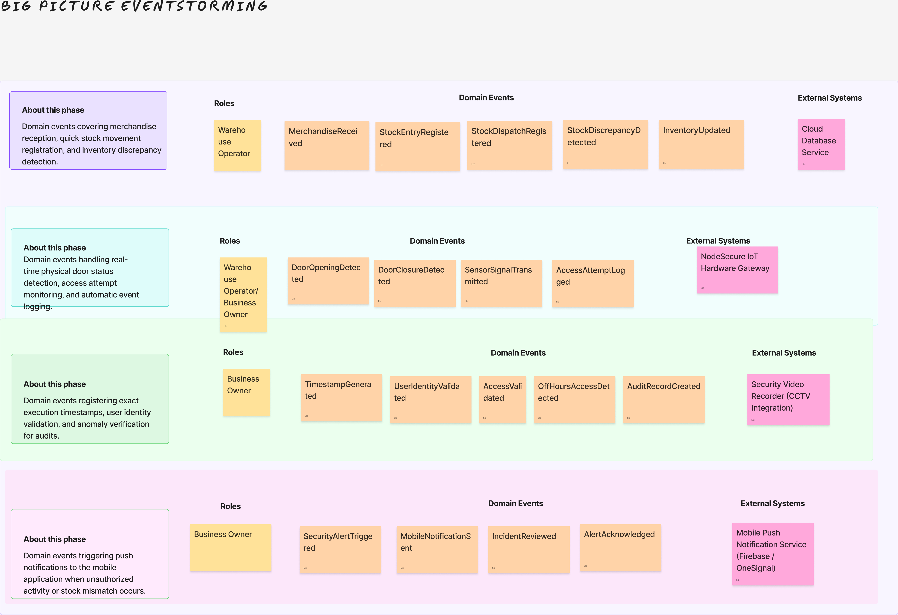

## 2.5. Ubiquitous Language

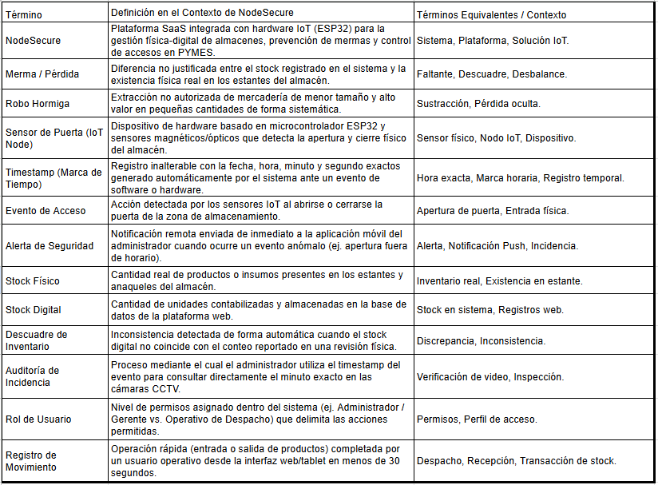

## 4.4. Web Applications UX/UI Design.

El diseño de la experiencia de usuario (UX) y de la interfaz (UI) de la plataforma NodeSecure se ha centrado en la operatividad bajo presión. Entendemos que un jefe de seguridad o un dueño de negocio entra a la aplicación web buscando respuestas rápidas: "¿Coincide mi inventario digital con la mercadería física?", "¿Hubo alguna salida de stock no registrada?". Por ello, la UX prioriza la conciliación del inventario en tiempo real, la gestión de entradas/salidas y la visualización de discrepancias detectadas por los sensores IoT. La UI, basada en Material Design, utiliza una estética limpia y profesional que reduce la carga cognitiva, permitiendo que el usuario identifique anomalías de stock o accesos mediante el uso estratégico de colores semánticos (rojo para discrepancias, verde para stock conciliado).

### 4.4.1. Web Applications Wireframes.

En esta sección se presentan los wireframes diseñados para las versiones desktop y mobile de la plataforma. Estos modelos estructurales establecen la arquitectura de la información, la jerarquía visual y los flujos de interacción principales sin la distracción de elementos gráficos complejos. Los wireframes detallan la experiencia del usuario administrador a través de los módulos críticos del sistema, como lo es el dashboard de discrepancias, la gestión de inventario (entradas y salidas), el historial de trazabilidad y el ecosistema de facturación. El objetivo de esta etapa es validar la usabilidad y la eficiencia de las tareas operativas antes de transicionar al diseño de alta fidelidad.

#### 1. User Goal: Acceso al sistema

Permitir a los dueños de PYMES y administradores registrar su empresa, ingresar a la plataforma NodeSecure de forma segura y recuperar sus credenciales en caso de olvido.

En el diseño del flujo de acceso, la arquitectura de información sigue un modelo de navegación lineal que guía al usuario paso a paso, evitando distracciones innecesarias. Se emplean campos de texto amplios y una tipografía sans-serif de alto contraste, lo que mejora la legibilidad y refuerza principios como la alineación y la simplicidad visual.

**Pantallas de flujo:**
* Formulario inicial donde el usuario registra sus datos personales, los de su empresa y crea una contraseña para iniciar su prueba gratuita.
* Pantalla de login estándar para usuarios que ya tienen una cuenta.
* Interfaz sencilla donde el usuario ingresa su correo electrónico para recibir un enlace de restablecimiento de acceso.

**Desktop**
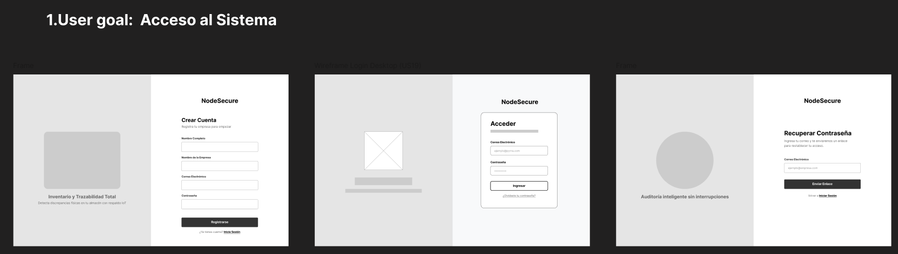

**Mobile**
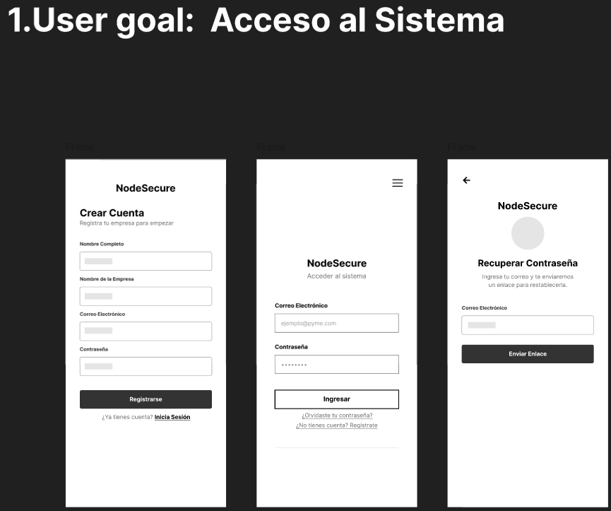

#### 2. User Goal: Registro y Monitoreo de Almacenes e Inventario

Proveer un panel de control para visualizar el estado de conciliación de stock de todas las sucursales en tiempo real y permitir la configuración de nuevos locales operativos.

Para el panel principal de almacenes, la arquitectura de información sigue un modelo jerárquico basado en cards, lo que permite visualizar y entender rápidamente el volumen de operaciones de múltiples sucursales. Se aplica el principio de contraste para resaltar claramente los estados de "Discrepancia Detectada" frente a los estados de "Stock Conciliado", facilitando una lectura rápida y priorizada de la información de auditoría en lugar de un simple monitoreo físico.

Otro aspecto de la información crítica no depende únicamente del color, ya que se complementa con etiquetas en texto que indican el tipo de evento físico no registrado o el desfase de inventario. Los botones de acción también cuentan con áreas táctiles amplias, lo que mejora la accesibilidad para usuarios con dificultades motrices.

**Pantallas de flujo:**
* Lista principal que muestra el estado en tiempo real de conciliación de inventario de cada sucursal registrada.
* Formulario para registrar una nueva sucursal y establecer sus parámetros de auditoría y horarios de operación de turnos.
* Estado del formulario que resalta visualmente en rojo los campos obligatorios faltantes o con formato incorrecto.
* Ventana emergente que confirma que el nuevo almacén ha sido guardado y está listo para vincularse al registro de movimientos de stock.

**Desktop**
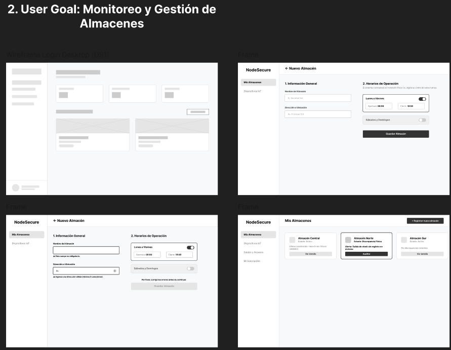

**Mobile**
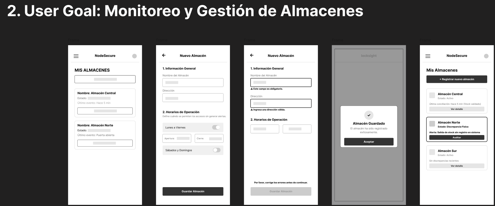

#### 3. User Goal: Administración de dispositivos IoT

Facilitar la vinculación de nuevos sensores IoT a zonas específicas del almacén para la recolección de evidencia física, visualizar su estado de conexión y controlar los límites de uso según la suscripción.

La vinculación y gestión de dispositivos se diseña con el objetivo de reducir la carga cognitiva, agrupando el hardware por categorías (ej. Sensores Magnéticos, Lectores RFID) para facilitar su identificación y acceso. Se aplica el principio de proximidad de Gestalt para organizar de forma clara la información de cada dispositivo junto a su estado de conexión, mientras que el uso de modales superpuestos permite realizar acciones sin perder el contexto de la pantalla principal. Desde un enfoque inclusivo, los formularios y acciones críticas, como la desvinculación de un sensor, presentan alto contraste y botones con descripciones claras y directas (“Sí, desvincular” y “Cancelar”), evitando ambigüedades y mejorando la comprensión para todo tipo de usuarios.

**Pantallas de flujo:**
* Inventario visual del hardware conectado que reporta evidencia física, indicando si están Online/Offline y mostrando el uso actual de la cuota del plan.
* Formulario para ingresar el número de serie de un equipo nuevo y asignarlo a una zona específica del almacén para cruzar su data con los movimientos digitales.
* Ventana emergente de éxito que confirma la correcta sincronización del nuevo sensor con el sistema.
* Ventana emergente de advertencia que bloquea la vinculación cuando el usuario ha alcanzado el límite de hardware permitido por su plan.

**Desktop**
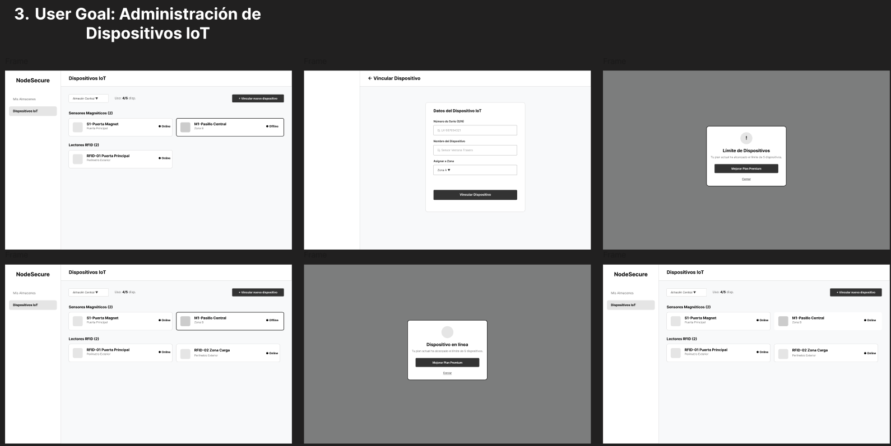

**Mobile**
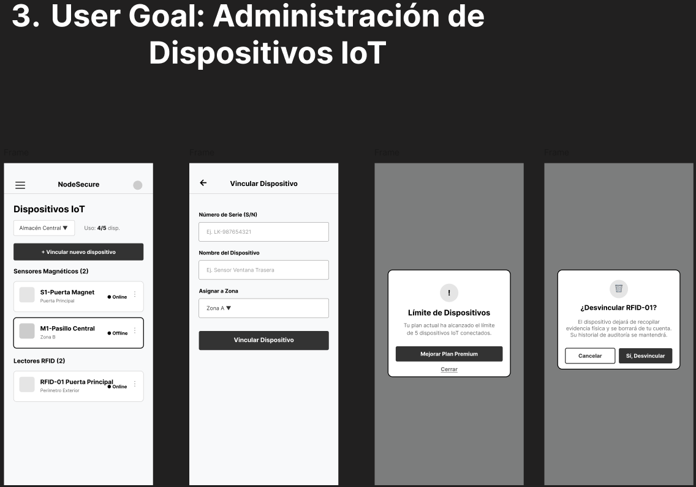

#### 4. User Goal: Auditoría de Eventos y Discrepancias

Permitir al usuario revisar la bitácora de trazabilidad del inventario, buscar movimientos o discrepancias mediante filtros y acceder al detalle de las alertas físicas no registradas.

Dado que el historial maneja grandes volúmenes de datos operativos, su arquitectura de información se organiza de forma secuencial y con opciones de filtrado claras para facilitar la búsqueda. Se aplica una jerarquía visual donde la hora y la gravedad de la discrepancia destacan en el primer nivel de lectura, permitiendo identificar rápidamente eventos donde el stock digital no coincide con la evidencia física del IoT.

**Pantallas de flujo:**
* Lista cronológica detallada de todas las actividades del almacén, diferenciando movimientos de stock validados de alertas por discrepancia física.
* Menús desplegables que permiten filtrar el historial por "Tipo de evento" (Entrada, Salida, Discrepancia) o "Rango de fechas".
* Ventana emergente y vista de detalle que muestra el resumen inmediato de una discrepancia sin perder el contexto de la auditoría.

**Desktop**
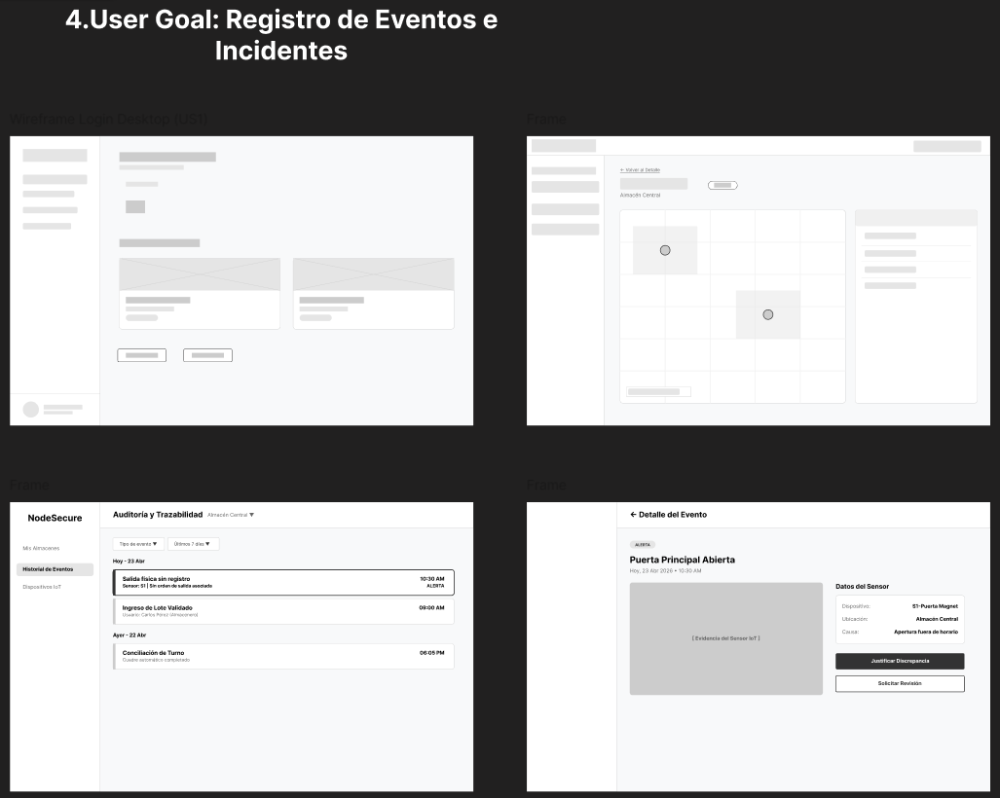

**Mobile**
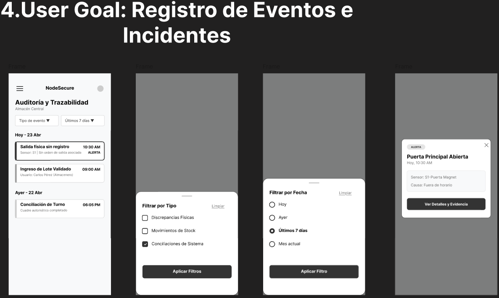

#### 5. User Goal: Gestión de personal y accesos

Controlar de forma segura qué empleados tienen acceso a la plataforma, invitar nuevos miembros y delimitar qué zonas de inventario pueden auditar o gestionar.

Este módulo utiliza una arquitectura de información facetada que separa claramente los roles de administrador y personal operativo (almaceneros/auditores), reduciendo el riesgo de errores en la asignación de permisos. Se aplica el principio de repetición en las tarjetas de usuario para mantener un orden visual consistente y fácil de seguir, mientras que elementos como los badges de roles emplean variaciones tonales sutiles para diferenciarlos sin sobrecargar la interfaz. Desde un enfoque inclusivo, la edición de permisos se apoya en interruptores visuales grandes acompañados de texto claro y confirmatorio, además de un diseño tolerante a errores que evita cambios accidentales, especialmente en usuarios con dificultades motoras.

**Pantallas de flujo:**
* Panel central que lista al equipo de trabajo, separando claramente a los Administradores del personal operativo asignado a los almacenes.
* Formulario para enviar una invitación por correo asignando un rol de sistema específico (Administrador, Almacenero o Auditor) a un nuevo miembro.
* Panel de configuración con opciones para habilitar o deshabilitar el acceso de un empleado a zonas de inventario específicas.
* Ventana emergente de advertencia destructiva para revocar definitivamente el acceso de un empleado a la plataforma.

**Desktop**
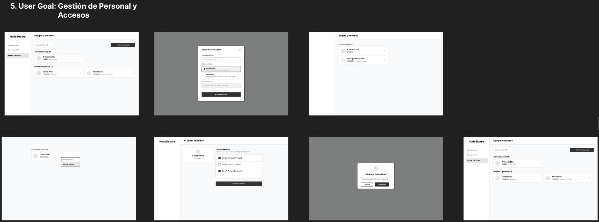

**Mobile**
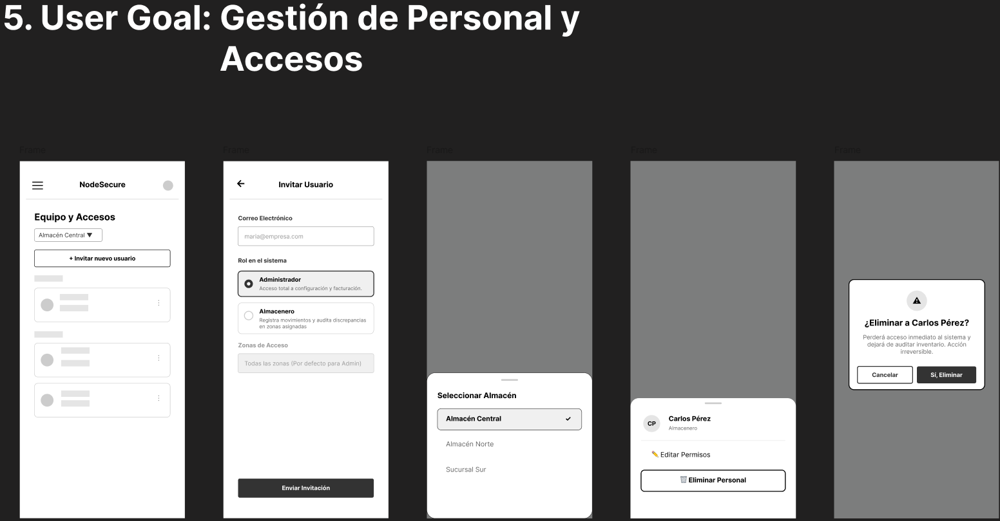

#### 6. User Goal: Administración de suscripción y facturación

Permitir a la empresa escalar sus operaciones mejorando su plan, personalizar límites a medida o gestionar la cancelación del servicio para adecuar la plataforma a su volumen de inventario.

El flujo de facturación guía al usuario desde la comparación de planes hasta el pago mediante una arquitectura de información progresiva. Además, se incorporan elementos interactivos como sliders y resúmenes de pago claros que facilitan la comprensión del proceso. Desde el enfoque inclusivo, se prioriza la legibilidad financiera mediante tipografías grandes para los montos y textos simples, evitando jerga técnica. Esto permite que usuarios con distintos niveles de conocimiento o limitaciones visuales comprendan fácilmente la información y tomen decisiones con mayor confianza al escalar su capacidad de auditoría.

**Pantallas de flujo:**
* Panel de resumen con el plan actual, fecha de próximo cobro y barras de progreso que muestran los límites consumidos de almacenes y nodos IoT.
* Pantalla comparativa de beneficios y precios entre los diferentes planes ofrecidos para la gestión de inventario.
* Interfaz de cotizador interactivo con controles deslizables para elegir la cantidad exacta de almacenes y sensores de evidencia necesarios.
* Pantalla de checkout que detalla el costo total, prorrateos y permite confirmar el método de pago con tarjeta.
* Ventana emergente de retención que advierte al usuario sobre las funcionalidades clave de trazabilidad que perderá si decide cancelar.
* Ventana emergente de confirmación de transacción aprobada y notificación de actualización de los límites del plan.
* Vista del dashboard en estado "sin plan" cuando la cuenta no posee una suscripción activa, bloqueando nuevas auditorías.

**Desktop**
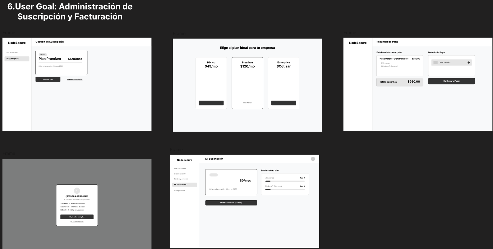

**Mobile**
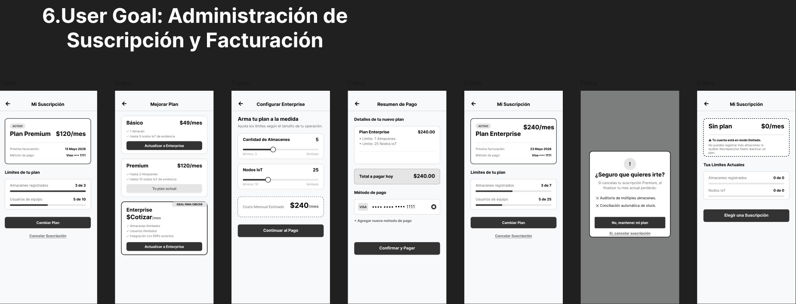

#### 7. User Goal: Configuración de cuenta y notificaciones

Dar control al usuario sobre sus credenciales de acceso y los canales por los cuales desea recibir alertas sobre discrepancias de inventario.

La sección de configuración organiza las preferencias operativas mediante una arquitectura categórica, aplicando el principio de agrupamiento para mantener juntas las opciones relacionadas y facilitar su comprensión. Se utilizan controles estándar y líneas divisorias sutiles que ordenan la interfaz sin recargarla, manteniendo una experiencia limpia y clara.

**Pantallas de flujo:**
* Menú de ajustes con interruptores para activar o desactivar notificaciones Push, Email y SMS enfocadas en reportes de auditoría y descuadres físicos.
* Ventana emergente que advierte al usuario sobre el riesgo operativo (pérdida de trazabilidad en tiempo real) si intenta silenciar por completo las notificaciones del sistema.
* Ventana emergente de confirmación que avisa sobre la pausa de recepción de alertas Push de inventario en el dispositivo actual al salir de la cuenta.

**Desktop**
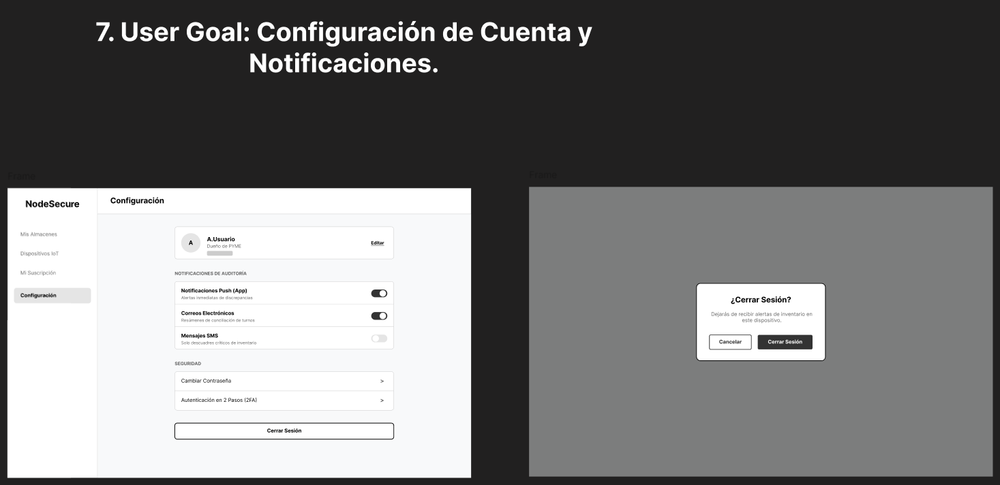

**Mobile**
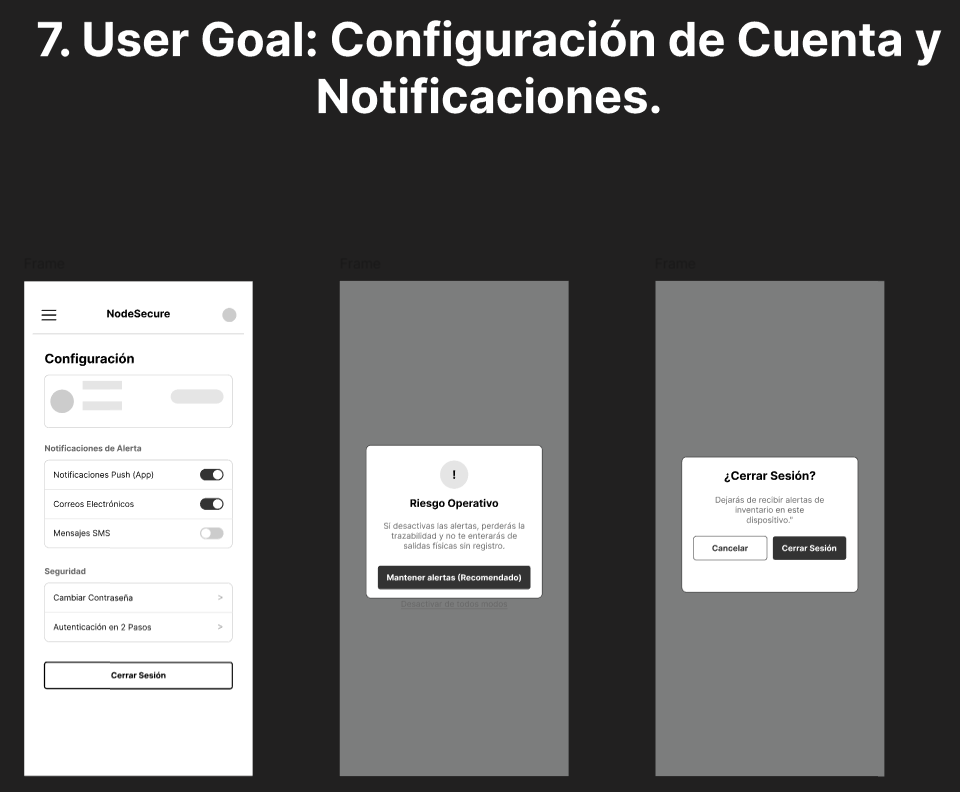

### 4.4.2. Web Applications Wireflow Diagrams

El Wireflow es un artefacto que combina la estructura de los wireframes con la lógica de un diagrama de flujo. Su importancia radica en que permite visualizar no solo qué elementos hay en cada pantalla, sino cómo el usuario se desplaza entre ellas para completar un proceso. Para **NodeSecure**, esto es vital porque el sistema debe ser capaz de guiar al usuario de forma intuitiva desde la detección de una discrepancia de stock hasta la conciliación del inventario en el menor número de pasos posible. En esta sección se detalla la arquitectura de navegación, mostrando los caminos que conectan el panel de control con los módulos de configuración de sensores IoT y revisión de historiales de auditoría.

#### 1. User Goal: Acceso al sistema

El flujo visual comienza con un nodo de inicio que lleva a la pantalla de presentación. Luego se presenta un rombo de decisión que evalúa si el usuario posee credenciales. De esa decisión se desprenden dos ramas: una que va hacia el registro de una nueva empresa y otra hacia el inicio de sesión tradicional. Ambas terminan en la validación y finalizan con el acceso al dashboard.

**El happy path:**
* **Inicio de la aplicación:** El administrador abre la plataforma web o móvil.
* **Pantalla principal:** Se muestra directamente la vista de inicio de sesión.
* **Decisión:** "¿El usuario tiene una cuenta?". En el *happy path* suponemos que el usuario ya es un cliente registrado.
* **Ingreso de datos:** El usuario completa los campos de correo electrónico y contraseña en el formulario.
* **Autenticación:** El usuario hace clic en el botón "Ingresar" y el sistema valida las credenciales correctamente en la base de datos.
* **Fin del flujo de acceso:** El usuario entra de manera exitosa a la aplicación y aterriza directamente en el dashboard de "Mis Almacenes" para comenzar a auditar su inventario.

**Diagrama Lógico:**
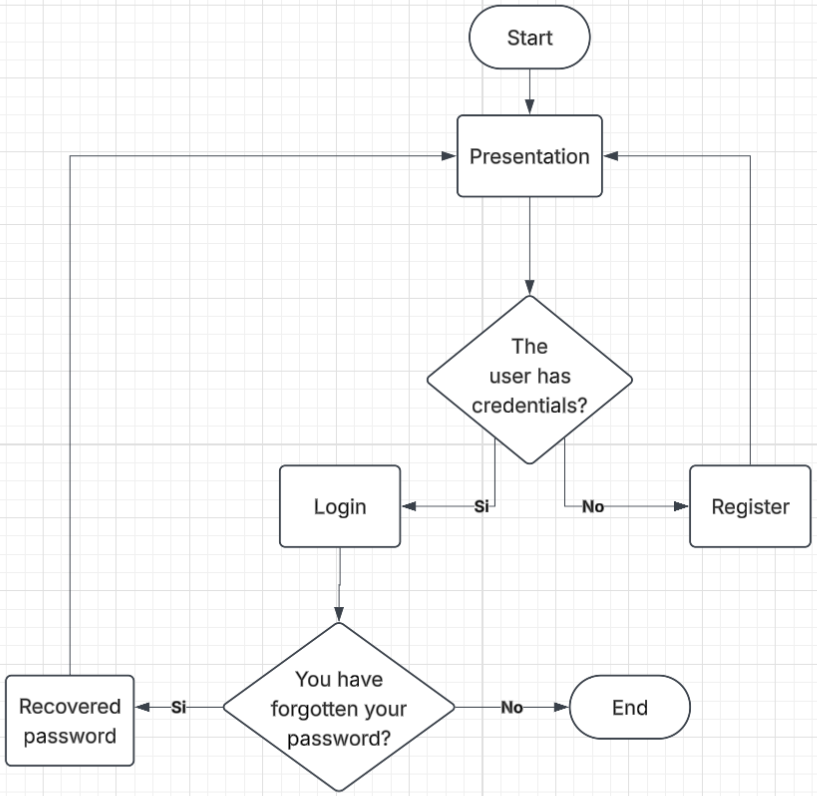

**Diagrama Visual (Wireflow):**
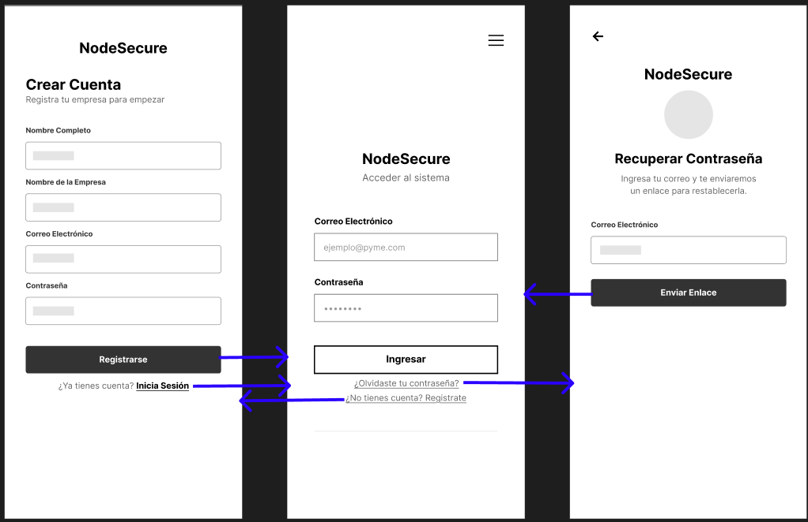

#### 2. User Goal: Registro y monitoreo de almacenes

Este flujo ilustra cómo un administrador registra un nuevo nodo logístico o sucursal desde el panel principal. El usuario completa un formulario con datos y horarios operativos; en caso de que la información sea incorrecta o falten campos obligatorios, el sistema bloquea el avance y muestra alertas preventivas en rojo. Al validar correctamente los datos, se confirma el registro mediante una ventana emergente de éxito y se redirige al usuario de vuelta al dashboard, donde el nuevo almacén ya aparece activo y listo para la conciliación de inventario.

**El happy path:**
* **Inicio:** El usuario se encuentra en el dashboard principal de "Mis Almacenes".
* **Acción:** Hace clic en el botón "+ Registrar nuevo almacén".
* **Ingreso de datos:** Llena el formulario de información general y horarios sin cometer errores.
* **Guardar:** Hace clic en el botón "Guardar Almacén".
* **Validación interna:** El sistema verifica que la dirección es válida y los campos obligatorios están completos.
* **Confirmación:** Aparece la ventana emergente con el mensaje "Almacén Guardado".
* **Fin del flujo:** El usuario regresa automáticamente al dashboard y visualiza la nueva sucursal en la lista, lista para auditar.

**Diagrama Lógico:**
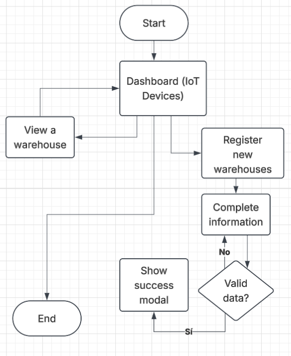

**Diagrama Visual (Wireflow):**
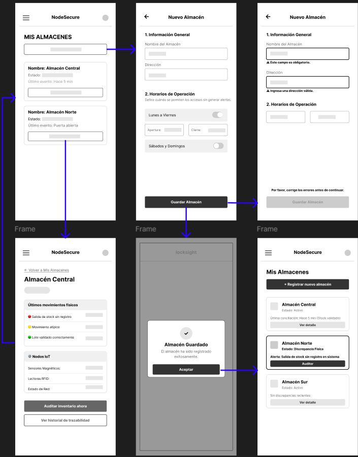